<div align="center">
  
  <!-- Animated Header -->
  
  
  <!-- Typing Animation -->
  
  
</div>

---

<div align="center">

## 🎯 WHO AM I?

<table>
<tr>
<td>

</td>
<td>

```yaml
name: Lucky Dawamuz Dzikri
located_in: Indonesia
education: Diploma 3 Informatics Engineering - GPA 3.82/4.00

currently_learning: Multi-platform Developer (Flutter), Framework (React.js)
2025_goal: have a job :)
hobbies: Gaming, Tech, Movies, and Music.

```
<!-- 
# website: -
# current_company: -
# current_role: - -->
</td>
</tr>
</table>


</div>

---

<div align="center">

## 🚀 TECH STACK & TOOLS


<br/><br/>

<!-- Programming Languages -->
 *Languages I Speak:*


</div>

---

<div align="center">

## 📊 GITHUB ANALYTICS


<br/>


</div>

---

<div align="center">

## 🏆 ACHIEVEMENTS & TROPHIES


</div>

---

<div align="center">

<!-- ## 💼 FEATURED PROJECTS

<table>
<tr>
<td width="50%">


### 🎨 [Your projectName1]

[Your projectDescription1]

*Tech Stack:* [Your projectStack1]

[]([Your projectLink1])
[]([Your projectRepo1])

</td>
<td width="50%">


### 🚀 [Your projectName2]

[Your projectDescription2]

*Tech Stack:* [Your projectStack2]

[]([Your projectLink2])
[]([Your projectRepo2])

</td>
</tr>
<tr>
<td width="50%">


### 🔥 [Your projectName3]

[Your projectDescription3]

*Tech Stack:* [Your projectStack3]

[]([Your projectLink3])
[]([Your projectRepo3])

</td>
<td width="50%">


### ⚡ [Your projectName4]

[Your projectDescription4]

*Tech Stack:* [Your projectStack4]

[]([Your projectLink4])
[]([Your projectRepo4])

</td>
</tr>
</table>

</div>

---

<div align="center"> -->


## 🎯 CURRENT FOCUS

```mermaid
graph TD
    A["🚀 Working On <br/> Web Portfolios"]
    B["📚 Learning <br/> Multi-platform Development"]
    C["💬 Ask Me About <br/> Fullstack Development"]
    D["💡 Fun Fact <br/> I love learning new tech!"]

    style A fill:#ff6b6b,stroke:#FFF,stroke-width:2px
    style B fill:#4ecdc4,stroke:#FFF,stroke-width:2px
    style C fill:#45b7d1,stroke:#FFF,stroke-width:2px
    style D fill:#96ceb4,stroke:#FFF,stroke-width:2px

```




<div align="center">

## 📈 CONTRIBUTION GRAPH


</div>

---

<div align="center">

## 🌐 CONNECT WITH ME


<!-- [](https://simoara.com) -->
[](https://linkedin.com/in/luckyd)
<!-- [](https://twitter.com/[Your twitterUsername])
[](https://instagram.com/[Your instagramUsername])
[](https://youtube.com/[Your youtubeChannel]) -->
[](mailto:luckydawamuzdzikri@gmail.com)

### 💬 Let's Talk About:
- 🔥 Web Development & Modern Frameworks
- 🤖 AI/ML & Data Science
- 🎨 UI/UX Design Principles
- 🚀 Startup Ideas & Innovation
- 📚 Tech Books & Learning Resources

</div>

---

<div align="center">

## 📊 WEEKLY DEVELOPMENT BREAKDOWN

<!--START_SECTION:waka-->
<!--END_SECTION:waka-->

</div>

<!-- ---

<div align="center">

## 🎵 SPOTIFY PLAYING

[](https://spotify-github-profile.vercel.app/api/spotify-playing)

</div>

--- -->

<div align="center">


### Thanks for visiting! Have a great day! ✨


</div>
